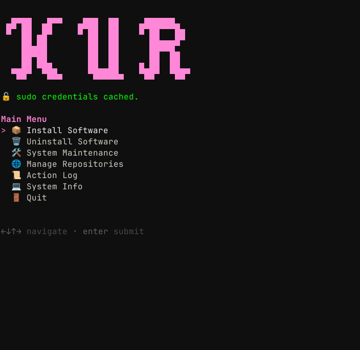
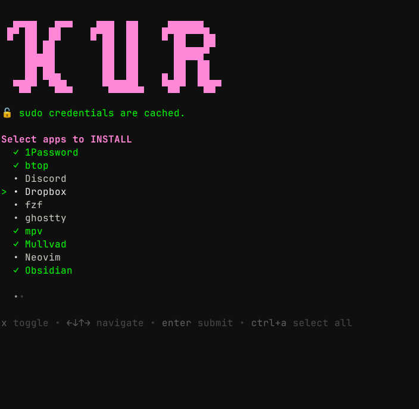
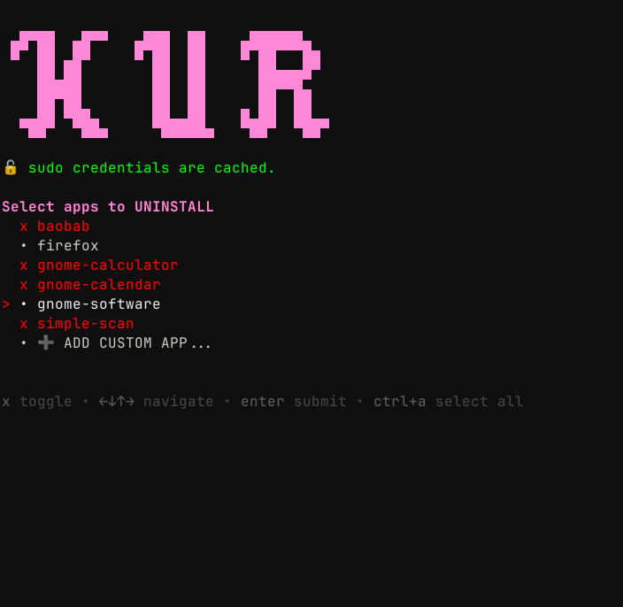
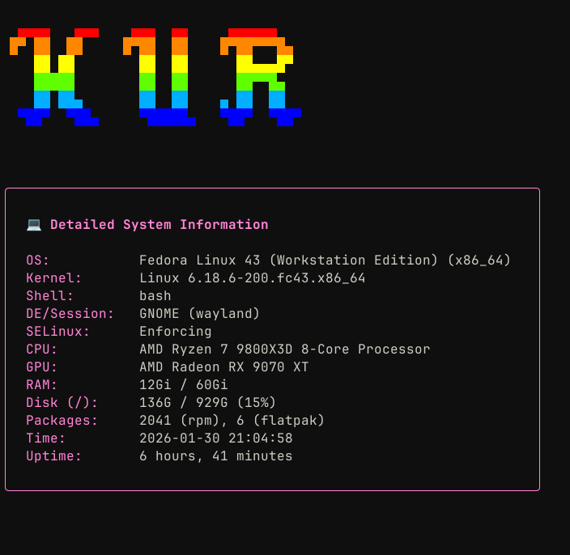

# kur

**kur** is an interactive, TUI-based setup script aimed at streamlining Fedora Workstation configuration. It automates software installation, repository management, and system maintenance with a clean interface powered by [`gum`](https://github.com/charmbracelet/gum).

<div align="center">
<table border="0">
  <tr>
    <td><a href="img/main-menu.png"></a></td>
    <td><a href="img/install-menu.png"></a></td>
    <td><a href="img/uninstall-menu.png"></a></td>
    <td><a href="img/sysinfo.png"></a></td>
  </tr>
  <tr>
    <td align="center">Main Menu</td>
    <td align="center">Install Menu</td>
    <td align="center">Uninstall Menu</td>
    <td align="center">System Info</td>
  </tr>
</table>
</div>

## Features

- **Smart Installation**: Automatically handles dependencies and explicitly enables required repositories (Terra, RPM Fusion, Flathub) only when needed.
- **Repository Management**: Quickly toggle RPM Fusion (Free/Non-Free), Terra (Fyra Labs), and Flathub.
- **App Management**: Robust installer/uninstaller that tracks changes and detects pre-installed GNOME applications.
- **System Maintenance**: Unified menu for system updates (`dnf`), Flatpak updates, and cache cleanup.
- **System Information**: Detailed view of hardware specs, OS version, kernel, and resource usage.
- **Context-Aware UI**: Live repository status checks, smart filtering for uninstall menus, and support for custom package input.
- **Safe Execution**: Caches `sudo` credentials carefully and provides a session-based action log.

## Usage

1.  Clone the repository:
    ```bash
    git clone https://github.com/aloglu/kur.git
    cd kur
    ```

2.  Make executable and run:
    ```bash
    chmod +x kur
    ./kur
    ```

> **Note**: The script requires `gum`. If not found, it will offer to install it automatically via DNF.

## Included Software

**kur** offers a curated selection of essential apps based on personal preference, handling their specific installation methods. You can also easily add your own applications:

*   **Development**: Zed, Neovim, Ghostty, fzf
*   **Productivity**: 1Password, Obsidian, Dropbox, Timeshift
*   **Media/Social**: Discord, Spotify, Steam, mpv
*   **System**: Mullvad VPN, btop

## License

Released under the [MIT License](https://github.com/aloglu/kur/blob/main/LICENSE).
